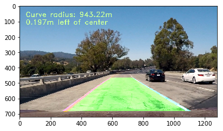

# **Project: Advance Lane Finding** 

In this project, your goal is to write a software pipeline to identify the lane boundaries in video from a front-facing camera on a car. The camera calibration images, test road images, and videos are available in this repository. Your job is to take what you've learned in this lesson and write a great lane-finding pipeline!  You can develop your pipeline on a series of individual images, and later apply the result to a video stream (really just a series of images).

There is no starter code provided, but you are welcome to use code from the lesson and quizzes as you like. You may complete the project in a jupyter notebook, but it's not required. Feel free to build it as a standalone project. 

For this project, you need to complete the following steps:

First, compute the camera calibration matrix and distortion coefficients given a set of chessboard images (in the camera_cal folder in the repository).

Next, for a series of test images (in the test_images folder in the repository):

    - Apply the distortion correction to the raw image.
    - Use color transforms, gradients, etc., to create a thresholded binary image.
    - Apply a perspective transform to rectify binary image ("birds-eye view").
    - Detect lane pixels and fit to find lane boundary.
    - Determine curvature of the lane and vehicle position with respect to center.
    - Warp the detected lane boundaries back onto the original image.
    - Output visual display of the lane boundaries and numerical estimation of lane curvature and vehicle position.

Once you have implemented a successful pipeline on the test images, you will run your algorithm on a video. In the case of the video, you must search for the lane lines in the first few frames, and, once you have a high-confidence detection, use that information to track the position and curvature of the lines from frame to frame.

## Camera Calibration with OpenCV


#### Compute camera matrix and distortion coefficients.

The code for this step is contained in the first code cell of the IPython notebook located in "./p4.ipynb".

**Step 1:** Prepare "object points", which will be the (x, y, z) coordinates of the chessboard corners in the world. 

Assuming the chessboard is fixed on the (x, y) plane at z=0, such that the object points are the same for each calibration image.  Thus, `objp` is just a replicated array of coordinates, and `objpoints` will be appended with a copy of it every time algorithm successfully detects all chessboard corners in a test image.

`imgpoints` will be appended with the (x, y) pixel position of each of the corners in the image plane with each successful chessboard detection.  

**Step 2:** Use the output `objpoints` and `imgpoints` to compute the camera calibration and distortion coefficients using the `cv2.calibrateCamera()` function.

**Step 3:** Apply this distortion correction to the test image using the `cv2.undistort()` function and obtained this result: 


```python
import numpy as np
import cv2
import glob
import matplotlib.pyplot as plt
import pickle
import os
from tqdm import tqdm
%matplotlib inline


def calculate_mtx_dist(images, nx = 9, ny = 6, verbose = False):

    # prepare object points, like (0,0,0), (1,0,0), (2,0,0) ....,(6,5,0)
    objp = np.zeros((ny*nx,3), np.float32)
    objp[:,:2] = np.mgrid[0:nx, 0:ny].T.reshape(-1,2)

    # Arrays to store object points and image points from all the images.
    objpoints = [] # 3d points in real world space
    imgpoints = [] # 2d points in image plane.

    # Step through the list and search for chessboard corners

    imgs = images

    if verbose:
      imgs = tqdm(images)

    for idx, fname in enumerate(imgs):
        img = cv2.imread(fname)
        gray = cv2.cvtColor(img, cv2.COLOR_BGR2GRAY)

        # Find the chessboard corners
        ret, corners = cv2.findChessboardCorners(gray, (nx,ny), None)

        # print('ret =', ret)

        # If found, add object points, image points
        if ret == True:
            objpoints.append(objp)
            imgpoints.append(corners)

            # Draw and display the corners
            if verbose:
              cv2.drawChessboardCorners(img, (nx,ny), corners, ret)
              write_name = 'output_images/corners_found/corners_found'+str(idx)+'.jpg'
              cv2.imwrite(write_name, img)
            # cv2.imshow('img', img)
            # cv2.waitKey(500)

    # Test undistortion on an image
    # img = cv2.imread('camera_cal/calibration1.jpg')
    img = cv2.imread(images[0])
    img_size = (img.shape[1], img.shape[0])

    # Do camera calibration given object points and image points
    ret, mtx, dist, rvecs, tvecs = cv2.calibrateCamera(objpoints, imgpoints, img_size, None, None)

    return mtx, dist

nx = 9
ny = 6


# Make a list of calibration images
images = glob.glob('camera_cal/calibration*.jpg')

mtx_dist_save_file = 'dist_pickle.p'

# Calculate calibration matrix
mtx, dist = calculate_mtx_dist(images, nx=9, ny=6, verbose=True)

# Save Distortion matrix and coefficient
with open(mtx_dist_save_file, 'wb') as f:
    saved_obj = {"mtx": mtx, "dist" : dist}
    pickle.dump(saved_obj, f)

# Load Saved Camera Matrix and Distortion Coefficients
dist_pickle = pickle.load(open(mtx_dist_save_file, "rb" ))
mtx = dist_pickle["mtx"]
dist = dist_pickle["dist"]


def undistort(img):
    result = cv2.undistort(img, mtx, dist, None, mtx)
    return result


def test_image_undistort():
    # ======= Test 1
    img = cv2.imread('test_images/test2.jpg')
    img = cv2.cvtColor(img, cv2.COLOR_BGR2RGB)
    
    dst = undistort(img)
    cv2.imwrite('output_images/test_undist1.jpg', cv2.cvtColor(dst, cv2.COLOR_RGB2BGR))
    
    
    # Visualize undistortion
    f, (ax1, ax2) = plt.subplots(1, 2, figsize=(20,10))
    ax1.imshow(img)
    ax1.set_title('Original Image 1', fontsize=30)
    ax2.imshow(dst)
    ax2.set_title('Undistorted Image 1', fontsize=30)
    
    plt.savefig('output_images/test_undist1_comp.jpg')
    
    
    # ======= Test 2
    img = cv2.imread('test_images/test3.jpg')
    img = cv2.cvtColor(img, cv2.COLOR_BGR2RGB)
    
    dst = undistort(img)
    cv2.imwrite('output_images/test_undist2.jpg', cv2.cvtColor(dst, cv2.COLOR_RGB2BGR))
    
    # Visualize undistortion
    f, (ax1, ax2) = plt.subplots(1, 2, figsize=(20,10))
    ax1.imshow(img)
    ax1.set_title('Original Image 2', fontsize=30)
    ax2.imshow(dst)
    ax2.set_title('Undistorted Image 2', fontsize=30)
    
    
    plt.savefig('output_images/test_undist2_comp.jpg')
    
    
    # ======= Test 3
    img = cv2.imread('camera_cal/calibration5.jpg')
    img = cv2.cvtColor(img, cv2.COLOR_BGR2RGB)
    
    dst = undistort(img)
    cv2.imwrite('output_images/test_undist3.jpg', cv2.cvtColor(dst, cv2.COLOR_RGB2BGR))
    
    # Visualize undistortion
    f, (ax1, ax2) = plt.subplots(1, 2, figsize=(20,6) ) # 
    ax1.imshow(img)
    ax1.set_title('Original Image 3', fontsize=30)
    ax2.imshow(dst)
    ax2.set_title('Undistorted Image 3', fontsize=30)
    
    plt.savefig('output_images/test_undist3_comp.jpg')
    
test_image_undistort()
```

    100%|██████████████████████████████████████████████████████████████████████████████████| 20/20 [00:02<00:00,  8.61it/s]
    


## Perspective Transformation & Image Thresholding

Now let's update the pipeline to include lane and lane boundary detection using image filtering. Then threshold the HLS L-channel and Lab B-channel of the image.

#### Methods to create a thresholded binary image.

Pipeline contains combination of color and gradient thresholds to generate a binary image (thresholding steps at code cell #2.

**Step 1:** Threshold color channel (L channel from HLS color space)

**Step 2:** Threshold color channel (B channel from LAB color space)

**Step 3:** Combine the thresholds from steps 1-2


```python
def warp(img):
    img_size = (img.shape[1], img.shape[0])
    width, height = img_size[:2]
    # define source and destination points for transform
    src = np.float32([(575,464),
                      (707,464), 
                      (258,682), 
                      (1049,682)])
    dst = np.float32([(450,0),
                  (width-450,0),
                  (450,height),
                  (width-450,height)])
    M = cv2.getPerspectiveTransform(src,dst)
    Minv = cv2.getPerspectiveTransform(dst, src)
    binary_warped = cv2.warpPerspective(img,M, (width, height), flags=cv2.INTER_LINEAR)
    return binary_warped, M, Minv

def lab_bthresh(img, thresh=(190,255)):
    # 1) Convert to LAB color space
    lab = cv2.cvtColor(img, cv2.COLOR_RGB2Lab)
    lab_b = lab[:,:,2]
    # don't normalize if there are no yellows in the image
    if np.max(lab_b) > 175:
        lab_b = lab_b*(255/np.max(lab_b))
    # 2) Apply a threshold to the L channel
    binary_output = np.zeros_like(lab_b)
    binary_output[((lab_b > thresh[0]) & (lab_b <= thresh[1]))] = 1
    # 3) Return a binary image of threshold result
    return binary_output

def hls_lthresh(img, thresh=(220, 255)):
    # 1) Convert to HLS color space
    hls = cv2.cvtColor(img, cv2.COLOR_RGB2HLS)
    hls_l = hls[:,:,1]
    hls_l = hls_l*(255/np.max(hls_l))
    # 2) Apply a threshold to the L channel
    binary_output = np.zeros_like(hls_l)
    binary_output[(hls_l > thresh[0]) & (hls_l <= thresh[1])] = 1
    # 3) Return a binary image of threshold result
    return binary_output

test_image_path = os.path.join('test_images', 'test1.jpg')
test_image = plt.imread(test_image_path)
plt.figure(figsize=(10,40))
plt.subplot(1,3,1)
plt.imshow(test_image, cmap='gray')
plt.title('Original Image')

plt.subplot(1,2,2)
binary_warped, M, Minv = warp(test_image)
plt.imshow(binary_warped, cmap='gray')
plt.title('Binary Warped Image: {}'.format(test_image_path))

# HLS L-channel Threshold (using default parameters)
img_LThresh = hls_lthresh(binary_warped)

# Lab B-channel Threshold (using default parameters)
img_BThresh = lab_bthresh(binary_warped)

# Combine HLS and Lab B channel thresholds
combined = np.zeros_like(img_BThresh)
combined[(img_LThresh == 1) | (img_BThresh == 1)] = 1

plt.subplot(1,3,3)
plt.imshow(combined)
plt.title('Thresholded')
```


    <matplotlib.text.Text at 0x19126e24c88>


## Detect lane pixels and fit to find lane boundary.

#### Identify lane-line pixels and fit their positions with a polynomial.

This step implemented in cell **#3** in the function `find_lines()`

Steps to fit lane lines with a 2nd order polynomial:

**Step 1:** Find the starting point for the left and right lines (take a histogram of the bottom half of the masked image)

**Step 2:** Set the width of the windows +/- margin (= 100), set minimum number of pixels found to recenter window (= 50)

**Step 3:** If lines are not detected - step through the windows one by one

**Step 4:** Extract left and right line pixel positions and Fit a second order polynomial to each (using np.polyfit

**Step 5:** Generate x and y values for plotting


```python
n = 0

# Define conversions in x and y from pixels space to meters
ym_per_pix = 30/720 # meters per pixel in y dimension
xm_per_pix = 3.7/660 # meters per pixel in x dimension

def find_lines(image, nwindows=10, margin=80, minpix=40):
    
    binary_warped = image
    
    # Take a histogram of the bottom half of the image
    histogram = np.sum(binary_warped[binary_warped.shape[0]//2:,:], axis=0)
    
    # Create an output image to draw on and  visualize the result
    out_img = np.dstack((binary_warped, binary_warped, binary_warped))*255
    
    # Find the peak of the left and right halves of the histogram
    # These will be the starting point for the left and right lines
    midpoint = np.int(histogram.shape[0]//2)
    quarter_point = np.int(midpoint//2)
    # Previously the left/right base was the max of the left/right half of the histogram
    # this changes it so that only a quarter of the histogram (directly to the left/right) is considered
    leftx_base = np.argmax(histogram[quarter_point:midpoint]) + quarter_point
    rightx_base = np.argmax(histogram[midpoint:(midpoint+quarter_point)]) + midpoint
    
    #print('base pts:', leftx_base, rightx_base)

    # Choose the number of sliding windows
    nwindows = 10
    # Set height of windows
    window_height = np.int(binary_warped.shape[0]/nwindows)
    # Identify the x and y positions of all nonzero pixels in the image
    nonzero = binary_warped.nonzero()
    nonzeroy = np.array(nonzero[0])
    nonzerox = np.array(nonzero[1])
    # Current positions to be updated for each window
    leftx_current = leftx_base
    rightx_current = rightx_base
    # Set the width of the windows +/- margin
    margin = 80
    # Set minimum number of pixels found to recenter window
    minpix = 40
    # Create empty lists to receive left and right lane pixel indices
    left_lane_inds = []
    right_lane_inds = []
    # Rectangle data for visualization
    rectangle_data = []

    # Step through the windows one by one
    for window in range(nwindows):
        # Identify window boundaries in x and y (and right and left)
        win_y_low = binary_warped.shape[0] - (window+1)*window_height
        win_y_high = binary_warped.shape[0] - window*window_height
        win_xleft_low = leftx_current - margin
        win_xleft_high = leftx_current + margin
        win_xright_low = rightx_current - margin
        win_xright_high = rightx_current + margin
        
        # Draw the windows on the visualization image
        cv2.rectangle(out_img,(win_xleft_low,win_y_low),(win_xleft_high,win_y_high),(0,255,0), 2) 
        cv2.rectangle(out_img,(win_xright_low,win_y_low),(win_xright_high,win_y_high),(0,255,0), 2)
        
        rectangle_data.append((win_y_low, win_y_high, win_xleft_low, win_xleft_high, win_xright_low, win_xright_high))
        # Identify the nonzero pixels in x and y within the window
        good_left_inds = ((nonzeroy >= win_y_low) & (nonzeroy < win_y_high) & (nonzerox >= win_xleft_low) & (nonzerox < win_xleft_high)).nonzero()[0]
        good_right_inds = ((nonzeroy >= win_y_low) & (nonzeroy < win_y_high) & (nonzerox >= win_xright_low) & (nonzerox < win_xright_high)).nonzero()[0]
        # Append these indices to the lists
        left_lane_inds.append(good_left_inds)
        right_lane_inds.append(good_right_inds)
        # If you found > minpix pixels, recenter next window on their mean position
        if len(good_left_inds) > minpix:
            leftx_current = np.int(np.mean(nonzerox[good_left_inds]))
        if len(good_right_inds) > minpix:        
            rightx_current = np.int(np.mean(nonzerox[good_right_inds]))

    # Concatenate the arrays of indices
    left_lane_inds = np.concatenate(left_lane_inds)
    right_lane_inds = np.concatenate(right_lane_inds)

    # Extract left and right line pixel positions
    leftx = nonzerox[left_lane_inds]
    lefty = nonzeroy[left_lane_inds] 
    rightx = nonzerox[right_lane_inds]
    righty = nonzeroy[right_lane_inds] 

    left_fit, right_fit = (None, None)
    # Fit a second order polynomial to each
    if len(leftx) != 0:
        left_fit = np.polyfit(lefty, leftx, 2)
    if len(rightx) != 0:
        right_fit = np.polyfit(righty, rightx, 2)
    
    visualization_data = (rectangle_data, histogram)
    
    return (left_fit, right_fit, left_lane_inds, right_lane_inds, out_img, nonzerox, nonzeroy, leftx_base, rightx_base, visualization_data)
```


```python
# visualize the result on example image
left_fit, right_fit, left_lane_inds, right_lane_inds, _, _, _, _, _, visualization_data = find_lines(combined)

h = combined.shape[0]
left_fit_x_int = left_fit[0]*h**2 + left_fit[1]*h + left_fit[2]
right_fit_x_int = right_fit[0]*h**2 + right_fit[1]*h + right_fit[2]
#print('fit x-intercepts:', left_fit_x_int, right_fit_x_int)

rectangles = visualization_data[0]
histogram = visualization_data[1]

# Create an output image to draw on and  visualize the result
out_img = np.uint8(np.dstack((combined, combined, combined))*255)
# Generate x and y values for plotting
ploty = np.linspace(0, combined.shape[0]-1, combined.shape[0] )
left_fitx = left_fit[0]*ploty**2 + left_fit[1]*ploty + left_fit[2]
right_fitx = right_fit[0]*ploty**2 + right_fit[1]*ploty + right_fit[2]
for rect in rectangles:
# Draw the windows on the visualization image
    cv2.rectangle(out_img,(rect[2],rect[0]),(rect[3],rect[1]),(0,255,0), 2) 
    cv2.rectangle(out_img,(rect[4],rect[0]),(rect[5],rect[1]),(0,255,0), 2) 
# Identify the x and y positions of all nonzero pixels in the image
nonzero = combined.nonzero()
nonzeroy = np.array(nonzero[0])
nonzerox = np.array(nonzero[1])
out_img[nonzeroy[left_lane_inds], nonzerox[left_lane_inds]] = [255, 0, 0]
out_img[nonzeroy[right_lane_inds], nonzerox[right_lane_inds]] = [100, 200, 255]
plt.imshow(out_img)
plt.plot(left_fitx, ploty, color='yellow')
plt.plot(right_fitx, ploty, color='yellow')
plt.xlim(0, 1280)
plt.ylim(720, 0)
```


    (720, 0)


### Polyfit Using Fit from Previous Frame

The test image appear, respectively, to be chronologically ordered frames from a single video capture


```python
def polyfit_using_prev_fit(binary_warped, left_fit_prev, right_fit_prev):
    nonzero = binary_warped.nonzero()
    nonzeroy = np.array(nonzero[0])
    nonzerox = np.array(nonzero[1])
    margin = 80
    left_lane_inds = ((nonzerox > (left_fit_prev[0]*(nonzeroy**2) + left_fit_prev[1]*nonzeroy + left_fit_prev[2] - margin)) & 
                      (nonzerox < (left_fit_prev[0]*(nonzeroy**2) + left_fit_prev[1]*nonzeroy + left_fit_prev[2] + margin))) 
    right_lane_inds = ((nonzerox > (right_fit_prev[0]*(nonzeroy**2) + right_fit_prev[1]*nonzeroy + right_fit_prev[2] - margin)) & 
                       (nonzerox < (right_fit_prev[0]*(nonzeroy**2) + right_fit_prev[1]*nonzeroy + right_fit_prev[2] + margin)))  

    # Again, extract left and right line pixel positions
    leftx = nonzerox[left_lane_inds]
    lefty = nonzeroy[left_lane_inds] 
    rightx = nonzerox[right_lane_inds]
    righty = nonzeroy[right_lane_inds]
    
    left_fit_new, right_fit_new = (None, None)
    if len(leftx) != 0:
        # Fit a second order polynomial to each
        left_fit_new = np.polyfit(lefty, leftx, 2)
    if len(rightx) != 0:
        right_fit_new = np.polyfit(righty, rightx, 2)
    return left_fit_new, right_fit_new, left_lane_inds, right_lane_inds
```


```python
# visualize the result on example image
margin = 80

left_fit2, right_fit2, left_lane_inds2, right_lane_inds2 = polyfit_using_prev_fit(combined, left_fit, right_fit)

# Generate x and y values for plotting
ploty = np.linspace(0, combined.shape[0]-1, combined.shape[0] )
left_fitx = left_fit[0]*ploty**2 + left_fit[1]*ploty + left_fit[2]
right_fitx = right_fit[0]*ploty**2 + right_fit[1]*ploty + right_fit[2]
left_fitx2 = left_fit2[0]*ploty**2 + left_fit2[1]*ploty + left_fit2[2]
right_fitx2 = right_fit2[0]*ploty**2 + right_fit2[1]*ploty + right_fit2[2]

# Create an image to draw on and an image to show the selection window
out_img = np.uint8(np.dstack((combined, combined, combined))*255)
window_img = np.zeros_like(out_img)

# Color in left and right line pixels
nonzero = combined.nonzero()
nonzeroy = np.array(nonzero[0])
nonzerox = np.array(nonzero[1])
out_img[nonzeroy[left_lane_inds2], nonzerox[left_lane_inds2]] = [255, 0, 0]
out_img[nonzeroy[right_lane_inds2], nonzerox[right_lane_inds2]] = [0, 0, 255]

# Generate a polygon to illustrate the search window area (OLD FIT)
# And recast the x and y points into usable format for cv2.fillPoly()
left_line_window1 = np.array([np.transpose(np.vstack([left_fitx-margin, ploty]))])
left_line_window2 = np.array([np.flipud(np.transpose(np.vstack([left_fitx+margin, ploty])))])
left_line_pts = np.hstack((left_line_window1, left_line_window2))
right_line_window1 = np.array([np.transpose(np.vstack([right_fitx-margin, ploty]))])
right_line_window2 = np.array([np.flipud(np.transpose(np.vstack([right_fitx+margin, ploty])))])
right_line_pts = np.hstack((right_line_window1, right_line_window2))

# Draw the lane onto the warped blank image
cv2.fillPoly(window_img, np.int_([left_line_pts]), (0,255, 0))
cv2.fillPoly(window_img, np.int_([right_line_pts]), (0,255, 0))
result = cv2.addWeighted(out_img, 1, window_img, 0.3, 0)
plt.imshow(result)
plt.plot(left_fitx2, ploty, color='yellow')
plt.plot(right_fitx2, ploty, color='yellow')
plt.xlim(0, 1280)
plt.ylim(720, 0)
```


    (720, 0)


## Determine curvature of the lane and vehicle position with respect to center.

Now let's update the pipeline to include calculations to determine curvature of the lane and vehicle position with respect to center.

#### Calculate the radius of curvature of the lane and the position of the vehicle with respect to center.

This step implemented in cell **#7** in the function `calc_curv_rad_and_center_dist`


```python
# Method to determine radius of curvature and distance from lane center 
# based on binary image, polynomial fit, and L and R lane pixel indices
def calc_curv_rad_and_center_dist(bin_img, l_fit, r_fit, l_lane_inds, r_lane_inds):
    # Define conversions in x and y from pixels space to meters
    ym_per_pix = 3.048/100 # meters per pixel in y dimension, lane line is 10 ft = 3.048 meters
    xm_per_pix = 3.7/378 # meters per pixel in x dimension, lane width is 12 ft = 3.7 meters
    left_curverad, right_curverad, center_dist = (0, 0, 0)
    # Define y-value where we want radius of curvature
    # I'll choose the maximum y-value, corresponding to the bottom of the image
    h = bin_img.shape[0]
    ploty = np.linspace(0, h-1, h)
    y_eval = np.max(ploty)
    
    # Identify the x and y positions of all nonzero pixels in the image
    nonzero = bin_img.nonzero()
    nonzeroy = np.array(nonzero[0])
    nonzerox = np.array(nonzero[1])
    # Again, extract left and right line pixel positions
    leftx = nonzerox[l_lane_inds]
    lefty = nonzeroy[l_lane_inds] 
    rightx = nonzerox[r_lane_inds]
    righty = nonzeroy[r_lane_inds]
    
    if len(leftx) != 0 and len(rightx) != 0:
        # Fit new polynomials to x,y in world space
        left_fit_cr = np.polyfit(lefty*ym_per_pix, leftx*xm_per_pix, 2)
        right_fit_cr = np.polyfit(righty*ym_per_pix, rightx*xm_per_pix, 2)
        # Calculate the new radii of curvature
        left_curverad = ((1 + (2*left_fit_cr[0]*y_eval*ym_per_pix + left_fit_cr[1])**2)**1.5) / np.absolute(2*left_fit_cr[0])
        right_curverad = ((1 + (2*right_fit_cr[0]*y_eval*ym_per_pix + right_fit_cr[1])**2)**1.5) / np.absolute(2*right_fit_cr[0])
        # Now our radius of curvature is in meters
        
    # Distance from center is image x midpoint - mean of l_fit and r_fit intercepts 
    if r_fit is not None and l_fit is not None:
        car_position = bin_img.shape[1]/2
        l_fit_x_int = l_fit[0]*h**2 + l_fit[1]*h + l_fit[2]
        r_fit_x_int = r_fit[0]*h**2 + r_fit[1]*h + r_fit[2]
        lane_center_position = (r_fit_x_int + l_fit_x_int) /2
        center_dist = (car_position - lane_center_position) * xm_per_pix
    return left_curverad, right_curverad, center_dist


rad_l, rad_r, d_center = calc_curv_rad_and_center_dist(combined, left_fit, right_fit, left_lane_inds, right_lane_inds)

print('Radius of curvature for example:', rad_l, 'm,', rad_r, 'm')
print('Distance from lane center for example:', d_center, 'm')
```

    Radius of curvature for example: 478.022945578 m, 1408.41202797 m
    Distance from lane center for example: -0.196917279748 m
    

## Lane Mapping & Drawing curvature data


```python
def draw_lane(original_img, binary_img, l_fit, r_fit, Minv):
    new_img = np.copy(original_img)
    if l_fit is None or r_fit is None:
        return original_img
    # Create an image to draw the lines on
    warp_zero = np.zeros_like(binary_img).astype(np.uint8)
    color_warp = np.dstack((warp_zero, warp_zero, warp_zero))
    
    h,w = binary_img.shape
    ploty = np.linspace(0, h-1, num=h)# to cover same y-range as image
    left_fitx = l_fit[0]*ploty**2 + l_fit[1]*ploty + l_fit[2]
    right_fitx = r_fit[0]*ploty**2 + r_fit[1]*ploty + r_fit[2]

    # Recast the x and y points into usable format for cv2.fillPoly()
    pts_left = np.array([np.transpose(np.vstack([left_fitx, ploty]))])
    pts_right = np.array([np.flipud(np.transpose(np.vstack([right_fitx, ploty])))])
    pts = np.hstack((pts_left, pts_right))

    # Draw the lane onto the warped blank image
    cv2.fillPoly(color_warp, np.int_([pts]), (0,255, 0))
    cv2.polylines(color_warp, np.int32([pts_left]), isClosed=False, color=(255,0,255), thickness=15)
    cv2.polylines(color_warp, np.int32([pts_right]), isClosed=False, color=(0,255,255), thickness=15)

    # Warp the blank back to original image space using inverse perspective matrix (Minv)
    newwarp = cv2.warpPerspective(color_warp, Minv, (w, h)) 
    # Combine the result with the original image
    result = cv2.addWeighted(new_img, 1, newwarp, 0.5, 0)
    return result

def draw_data(original_img, curv_rad, center_dist):
    new_img = np.copy(original_img)
    h = new_img.shape[0]
    font = cv2.FONT_HERSHEY_DUPLEX
    text = 'Curve radius: ' + '{:04.2f}'.format(curv_rad) + 'm'
    cv2.putText(new_img, text, (40,70), font, 1.5, (200,255,155), 2, cv2.LINE_AA)
    direction = ''
    if center_dist > 0:
        direction = 'right'
    elif center_dist < 0:
        direction = 'left'
    abs_center_dist = abs(center_dist)
    text = '{:04.3f}'.format(abs_center_dist) + 'm ' + direction + ' of center'
    cv2.putText(new_img, text, (40,120), font, 1.5, (200,255,155), 2, cv2.LINE_AA)
    return new_img

test_image_out = draw_lane(test_image, combined, left_fit, right_fit, Minv)
plt.imshow(test_image_out)
test_image_out2 = draw_data(test_image_out, (rad_l+rad_r)/2, d_center)
plt.imshow(test_image_out2)
```


    <matplotlib.image.AxesImage at 0x19128a315c0>





### Define a Line Class for Storing Data


```python
# Define a class to receive the characteristics of each line detection
class Line():
    def __init__(self):
        # was the line detected in the last iteration?
        self.detected = False  
        # x values of the last n fits of the line
        self.recent_xfitted = [] 
        #average x values of the fitted line over the last n iterations
        self.bestx = None     
        #polynomial coefficients averaged over the last n iterations
        self.best_fit = None  
        #polynomial coefficients for the most recent fit
        self.current_fit = []  
        #radius of curvature of the line in some units
        self.radius_of_curvature = None 
        #distance in meters of vehicle center from the line
        self.line_base_pos = None 
        #difference in fit coefficients between last and new fits
        self.diffs = np.array([0,0,0], dtype='float') 
        #number of detected pixels
        self.px_count = None
    def add_fit(self, fit, inds):
        # add a found fit to the line, up to n
        if fit is not None:
            if self.best_fit is not None:
                # if we have a best fit, see how this new fit compares
                self.diffs = abs(fit-self.best_fit)
            if (self.diffs[0] > 0.001 or \
               self.diffs[1] > 1.0 or \
               self.diffs[2] > 100.) and \
               len(self.current_fit) > 0:
                # bad fit! abort! abort! ... well, unless there are no fits in the current_fit queue, then we'll take it
                self.detected = False
            else:
                self.detected = True
                self.px_count = np.count_nonzero(inds)
                self.current_fit.append(fit)
                if len(self.current_fit) > 5:
                    # throw out old fits, keep newest n
                    self.current_fit = self.current_fit[len(self.current_fit)-5:]
                self.best_fit = np.average(self.current_fit, axis=0)
        # or remove one from the history, if not found
        else:
            self.detected = False
            if len(self.current_fit) > 0:
                # throw out oldest fit
                self.current_fit = self.current_fit[:len(self.current_fit)-1]
            if len(self.current_fit) > 0:
                # if there are still any fits in the queue, best_fit is their average
                self.best_fit = np.average(self.current_fit, axis=0)
```

## Final pipeline test on Images

Now let's build the complete pipeline to work on the images in the directory "test_images" before we try the videos.


```python
def show_images(images, cols = 2, rows = 4, figsize=(15,20), cmap = None):
    """
    Display `images` on a [`cols`, `rows`] subplot grid.
    """
    imgLength = len(images)
    fig, axes = plt.subplots(rows, cols, figsize=figsize)
    indexes = range(cols * rows)
    for ax, index in zip(axes.flat, indexes):
        if index < imgLength:
            imagePathName, image = images[index]
            if cmap == None:
                ax.imshow(image)
            else:
                ax.imshow(image, cmap=cmap)
            ax.set_title(imagePathName)
            ax.axis('off')

def pipeline(img, fontScale=2):
    """
    Find and draw the lane lines on the image `img`.
    """
    new_img = np.copy(img)
    undistort_img = undistort(img)
    binary_warped, M, Minv = warp(undistort_img)
    
    # HLS L-channel Threshold (using default parameters)
    img_LThresh = hls_lthresh(binary_warped)
    
    # Lab B-channel Threshold (using default parameters)
    img_BThresh = lab_bthresh(binary_warped)
    
    # Combine HLS and Lab B channel thresholds
    combined = np.zeros_like(img_BThresh)
    combined[(img_LThresh == 1) | (img_BThresh == 1)] = 1
    
    
    
    # if both left and right lines were detected last frame, use polyfit_using_prev_fit, otherwise use sliding window
    if not l_line.detected or not r_line.detected:
        l_fit, r_fit, l_lane_inds, r_lane_inds, _, _, _, _, _, _ = find_lines(combined)
    else:
        l_fit, r_fit, l_lane_inds, r_lane_inds = polyfit_using_prev_fit(combined, l_line.best_fit, r_line.best_fit)
   
    # invalidate both fits if the difference in their x-intercepts isn't around 350 px (+/- 100 px)
    if l_fit is not None and r_fit is not None:
        # calculate x-intercept (bottom of image, x=image_height) for fits
        h = img.shape[0]
        l_fit_x_int = l_fit[0]*h**2 + l_fit[1]*h + l_fit[2]
        r_fit_x_int = r_fit[0]*h**2 + r_fit[1]*h + r_fit[2]
        x_int_diff = abs(r_fit_x_int-l_fit_x_int)
        if abs(350 - x_int_diff) > 100:
            left_fit = None
            right_fit = None
    
    l_line.add_fit(l_fit, l_lane_inds)
    r_line.add_fit(r_fit, r_lane_inds)
    
    # draw the current best fit if it exists
    if l_line.best_fit is not None and r_line.best_fit is not None:
        img_out1 = draw_lane(new_img, combined, l_line.best_fit, r_line.best_fit, Minv)
        rad_l, rad_r, d_center = calc_curv_rad_and_center_dist(combined, l_line.best_fit, r_line.best_fit, 
                                                               l_lane_inds, r_lane_inds)
        img_out = draw_data(img_out1, (rad_l+rad_r)/2, d_center)
    else:
        img_out = new_img
    
    return img_out


output_images = []

# Load test images.
testImages = list(map(lambda imageFileName: (imageFileName, cv2.imread(imageFileName)), 
                      glob.glob('./test_images/*.jpg')))

l_line = Line()
r_line = Line()

for filename in glob.glob("./test_images/*.jpg"):
    im = plt.imread(filename)
    output = pipeline(im)
    insert = []
    insert.append(filename)
    insert.append(output)
    output_images.append(insert)
    
show_images(output_images)
```


## Test on Videos

know what's cooler than drawing lanes over images? Drawing lanes over video!

We can test our solution on three provided videos:

Standard: `project_video.mp4`

Challenge: `challenge_video.mp4`

Harder Challenge: `harder_challenge_video.mp4`

### Standard: `project_video.mp4`


```python
from moviepy.editor import VideoFileClip

l_line = Line()
r_line = Line()

video_output = 'project_video_output.mp4'
clip = VideoFileClip('project_video.mp4')

output_clip = clip.fl_image(pipeline)
%time output_clip.write_videofile(video_output, audio=False)
```

    [MoviePy] >>>> Building video project_video_output.mp4
    [MoviePy] Writing video project_video_output.mp4
    

    100%|█████████████████████████████████████████████████████████████████████████████▉| 1260/1261 [01:45<00:00, 12.02it/s]
    

    [MoviePy] Done.
    [MoviePy] >>>> Video ready: project_video_output.mp4 
    
    Wall time: 1min 45s
    


```python
from IPython.display import HTML

HTML("""
<video width="960" height="540" controls>
  <source src="{0}">
</video>
""".format(video_output))
```


<video width="960" height="540" controls>
  <source src="project_video_output.mp4">
</video>


### Challenge: `challenge_video.mp4`


```python
l_line = Line()
r_line = Line()
video_output2 = 'challenge_video_output.mp4'
clip2 = VideoFileClip('challenge_video.mp4')

output_clip2 = clip2.fl_image(pipeline)
%time output_clip2.write_videofile(video_output2, audio=False)
```

    [MoviePy] >>>> Building video challenge_video_output.mp4
    [MoviePy] Writing video challenge_video_output.mp4
    

    100%|████████████████████████████████████████████████████████████████████████████████| 485/485 [00:39<00:00, 11.19it/s]
    

    [MoviePy] Done.
    [MoviePy] >>>> Video ready: challenge_video_output.mp4 
    
    Wall time: 40.3 s
    


```python
HTML("""
<video width="960" height="540" controls>
  <source src="{0}">
</video>
""".format(video_output2))
```


<video width="960" height="540" controls>
  <source src="challenge_video_output.mp4">
</video>


### Harder Challenge: `harder_challenge_video.mp4`


```python
l_line = Line()
r_line = Line()
video_output3 = 'harder_challenge_video_output.mp4'
clip3 = VideoFileClip('harder_challenge_video.mp4')

output_clip3 = clip3.fl_image(pipeline)
%time output_clip3.write_videofile(video_output3, audio=False)
```


```python
HTML("""
<video width="960" height="540" controls>
  <source src="{0}">
</video>
""".format(video_output3))
```


```python

```
